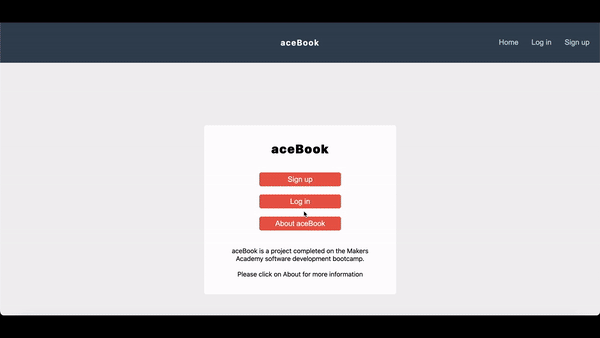

### Summary

aceBook is a group project completed on the Makers Academy software development bootcamp.

The brief for the project was to create a 'facebook clone' from a skeleton legacy codebase.

[live site](https://aws-fe.dzq2c3fblb9ts.amplifyapp.com/login)

If you would like to login as an existing user please use these details

- email: alice@example.com
- password: Passw0rd!A

### Description

The legacy codebase [here](https://github.com/makersacademy/acebook-mern-vite) provided routes for a user to login and sign up.

Over two weeks as a team we developed the following user features

- create new posts with text +/- an image
- edit and delete own posts
- like/unlike and comment on posts
- view all posts from users on a feed page
- edit bio and profile picture
- befriend other users
- notifications for new friends / comments / likes

### Working Process

Embracing Agile methodologies involving iterative development cycles, daily stand-ups and sprint planning to define and prioritise tasks. Organised workflow through a ticket system to ensure tracking and management of tasks throughout the project.

### Contributors

- [Dan Gullis](https://github.com/dgullis)
- [Simon Budden](https://github.com/fantastito)
- [Ed Gemmill](https://github.com/EdGemmill)
- [Nick Torkington](https://github.com/N1ckT0rk)
- [Thomas Powell](https://github.com/Tomtommx8)

